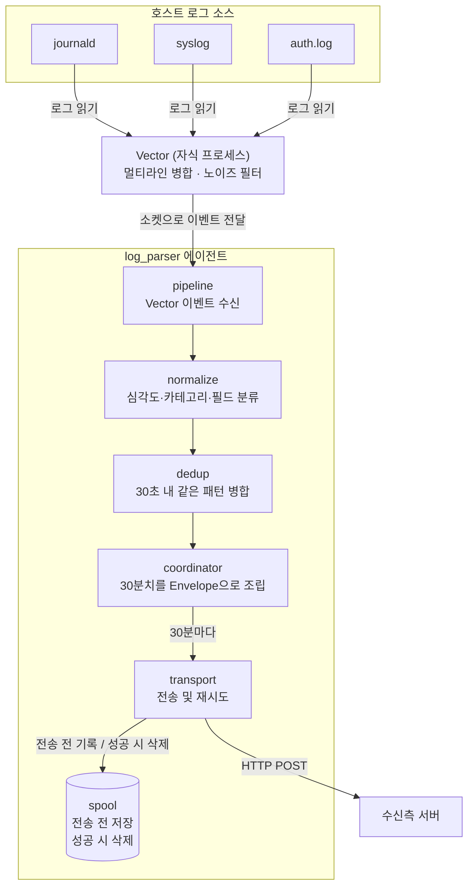
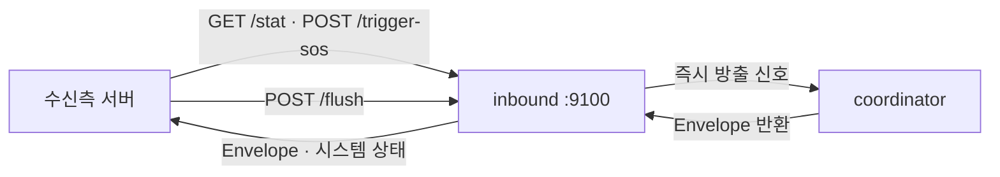
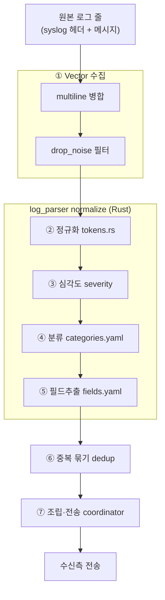

# log_parser

호스트 로그를 수집·정제·압축하여 수신측 서버로 30분마다 자동 전송하는 경량 Rust 에이전트.

**이 문서의 대상**: log_parser가 보내는 데이터를 받는 서버를 개발·운영하는 팀

> 최근 변경 내역은 맨 아래 [변경 이력](#변경-이력) 참조.

---

## 설계 의도 · 책임 경계 (먼저 읽기)

이 프로젝트가 왜 이렇게 나뉘어 있는지 이해하려면 **책임 경계** 하나만 잡으면 된다.

**파서(엣지)가 하는 일 = 수집 → 정제(정규화·dedup) → 압축 → 전송.** 그게 전부다.
감시 대상 호스트마다 얹혀 도는 에이전트라 **의도적으로 가볍게**(cgroup 기본 메모리 128MB / CPU 5%) 묶여 있다.

**파서가 하지 않는 일 = 저장·조회·분석·검색.** 로그를 오래 쌓아두거나(DB·시계열), 의미 검색(벡터)하거나, 대시보드로 집계하는 것은 **전부 중앙 플랫폼(수신측)의 몫**이다. 파서는 데이터 저장 방식을 책임지지 않는다 — 처리해서 내보낼 뿐이고, "어떻게 저장·질의할지"는 받는 쪽이 정한다.

> **왜 이 경계인가**: 파서는 고객의 실제 서비스가 도는 호스트에 얹혀산다. 거기에 DB·벡터엔진을 심으면 감시 대상과 자원을 다투고 "경량 에이전트" 정체성이 깨진다. 그래서 무거운 저장·분석은 감시 대상 밖의 중앙으로 전부 뺀다.

이 경계가 디렉토리 구성으로 그대로 드러난다:

| 위치 | 담당 | 성격 |
|------|------|------|
| [`config/`](config/) | 파서가 **무엇을 어떻게 처리하는가** (분류·필드·전송 설정) | 파서 소유(정본) |
| [`docs/`](docs/) | 설계·계약 — 파서가 **무엇을 내보내는가**, 그리고 저장은 왜 중앙 몫인가 | 파서 소유(정본) |
| [`reference/`](reference/) | 중앙(수신측 `log_stack_AI`)의 산출물 **참조 스냅샷** — 정본 아님 | 읽기 전용 사본 |

- 저장을 중앙이 어떻게 할지 정한 **계약**: [`docs/6_SCALE_CONTRACT.md`](docs/6_SCALE_CONTRACT.md) (증분 pull·이벤트 스토어는 미채택, 기존 push/스냅샷으로 소비하기로 결정)
- 중앙 플랫폼을 실제로 짓는 **로드맵**: `log_stack_AI/docs/1_CENTRAL_PLATFORM_ROADMAP.md` (별도 repo)

---

## ⭐ 가장 중요한 파일 (반드시 직접 관리)

각 파일이 하는 일은 다음과 같다.

### `config/agent.yaml` — 에이전트 동작 정의 ⭐

수집 대상(journald·syslog·auth.log 등 어떤 로그를 모을지), 전송 주기·목적지(30분마다 어느 수신측으로 push),
호스트 식별(`cycle.host_override` 로 표시 이름 고정), inbound 포트·토큰, spool·재시도 정책 등
**에이전트의 모든 동작**을 정의한다. 이 파일이 잘못되면 데이터 수집·전송 자체가 흔들린다.

### `config/categories.yaml` — 로그 분류 규칙 ⭐

원본 로그를 카테고리(예: `kernel.oom`, `auth.event`, `session.activity`)로 가르는 규칙이다.
위에서부터 first-match-wins 정규식으로 매칭하고, `program:` 조건으로 출처(sshd/CRON 등)까지 구분한다(본문이 같아도 출처가 다른 로그를 가름).
규칙을 구체적인 것일수록 위에, 광범위한 것일수록 아래에 두며 맨 끝의 빈 패턴이 `system.general` fallback이다.
이 카테고리 체계가 **시스템 전체의 뼈대**라서, 수신측(log_stack_AI)의 검색 한국어 설명(`CATEGORY_KO`)·`goldset.yaml`·`playbook.yaml` 이 모두 여기에 맞물려 있다.
**분류가 어긋나면 수신측 분석·검색 품질이 그대로 떨어진다.** 코드 변경 없이 이 파일 수정 + 에이전트 재시작으로 반영된다.

> 따라서 `categories.yaml` **을 바꾸면** 수신측의 `CATEGORY_KO`·`goldset.yaml`(검색 채점 기준)·`playbook.yaml`(원인·대처 지식)도
> **반드시 같이 손봐야 한다**(카테고리가 서로 맞물려 있음).
>
> 📎 **참고**: 맞물린 수신측 파일 두 개(`playbook.yaml`, `goldset.yaml`)의 스냅샷을 인수인계용으로
> [`reference/stack/`](reference/stack/) 에 복사해 두었다. 카테고리를 바꿀 때 무엇이 함께 바뀌어야 하는지
> 거기서 실물로 확인할 수 있다. **정본은 `log_stack_AI`** 이며, 사본은 자동 갱신되지 않는다
> (동기화 방법은 [`reference/stack/README.md`](reference/stack/README.md) 참조).


### `config/fields.yaml` — 필드 추출 규칙 ⭐

로그 본문에서 구조화 필드(`pid`, `user`, `dev`, `unit` …)를 뽑는 규칙이다. 예전에는 소스 코드에
하드코딩돼 있었으나, 이제 이 파일에서 정의한다 — **코드 변경·재빌드 없이** 규칙을 추가할 수 있다(`categories.yaml`과 동일 방식).

- `fields:` — 각 규칙은 정규식 캡처그룹 1을 값으로 저장한다(`numeric: true` 면 정수로).
- `settings.logfmt: true` — 메시지 안의 임의 `key=value`(예: `site=naver.com code=200 duration=1.5`)를 자동 필드로 승격.
- `settings.json: true` — 메시지 안의 JSON 객체(`{...}`) 최상위 스칼라를 자동 필드로 승격.
- `settings.allow` / `settings.max_auto_fields` — 자동 승격 필드의 **화이트리스트**와 **개수 상한**. auditd 처럼 `key=value` 가 폭주하는 로그를 막는 안전장치다(비우면 상한까지 전부 허용).

추출된 필드는 dedup·수신측 검색 라벨로 쓰이며, `categories.yaml`의 `logger:` 조건도 여기서 뽑은 `logger` 필드를 참조한다.
파일이 없거나 깨지면 에이전트는 기존 내장(builtin) 추출기 6종으로 자동 fallback 한다.


```markdown
categories = 로그 분류
fields = 필드 추출
playbook = 답변 지식 (재료) ← 여기만 정정
goldset = 검색 채점 기준 (점수)


(수집 시점) 분류 → 필드추출 ← 로그 들어올 때 미리
(질문 시점) 검색+게이트 → playbook 답변 ← 질문할 때
(측정, 따로) goldset 채점 ← 평가하고 싶을 때 수동
```

---


## 전체 흐름

```
호스트 서버
├── journald (systemd 로그)
├── /var/log/syslog
└── /var/log/auth.log
         │
         ▼
   [log_parser 에이전트]
   Vector 수집(멀티라인 병합·노이즈 필터) → 정규화(심각도·카테고리·필드) → 중복제거 → Envelope 조립
         │
         │  POST /ingest
         │  Authorization: Bearer <TOKEN>
         │  Content-Encoding: gzip
         │  Content-Type: application/json
         ▼
   [수신측 서버] ← 여기서부터 구현 대상
```

에이전트와 수신측 서버 간의 통신은 두 가지 방향이 있습니다.


| 방향       | 호출자    | 수신자    | 수신측이 구현할 것               |
| -------- | ------ | ------ | ------------------------ |
| **push** | 에이전트   | 수신측 서버 | `POST /ingest` 엔드포인트     |
| **pull** | 수신측 서버 | 에이전트   | `GET/POST` 호출 클라이언트 (선택) |


- **push** — 에이전트가 30분마다 자동으로 수신측 서버로 HTTP POST를 보냅니다.
- **pull** — 수신측 서버가 필요할 때 에이전트의 `/stat`, `/trigger-sos` 엔드포인트를 직접 호출할 수 있습니다.

**Push — 30분마다 자동 전송**




**Pull — 수신 서버가 에이전트에 직접 요청**




> **Vector 수집 단계 (자동 생성** `vector.toml`**)** — 파일 소스(syslog·auth)는 타임스탬프 헤더로 시작하는 줄을 새 이벤트로 보고, 헤더 없는 후속 줄(자바 스택트레이스·커널 콜트레이스)을 **한 이벤트로 병합**한다(multiline). 이어서 route/소켓으로 넘어가기 전에 **노이즈 필터(drop_noise)** 가 잡음 로그(기본: journald debug)를 버려 Rust 부하·전송량을 줄인다. 버려진 원본이 필요하면 pull API(`/trigger-sos`·`/stat`)로 회수할 수 있다. 이 설정은 distro 감지 결과로 에이전트가 **자동 생성**하므로 직접 편집하지 않는다.


### 로그 한 줄이 처리되는 과정 (단계별)

**여러 겹 정수기 필터**를 떠올리면 쉽다 — 지저분한 원본 로그가 단계를 지날 때마다 걸러지고 라벨이 붙어, 마지막엔 깔끔하게 정리된 한 건으로 나온다. 각 단계가 **무슨 일을 하고 무엇을 만들어내는지**를 한눈에 정리한다. (기능이 계속 늘어나므로 "어디서 무슨 일을 하는지"의 단일 기준표로 둔다.)




| 단계                           | 하는 일 (쉽게)                                                                         | 자세히                                                                              | 결과물                                 |
| ---------------------------- | --------------------------------------------------------------------------------- | -------------------------------------------------------------------------------- | ----------------------------------- |
| **① Vector 수집**              | 로그를 읽어오면서, 여러 줄로 쪼개진 로그(자바 에러 등)를 **한 덩어리로 붙이고** 쓸모없는 잡음은 **버린다**                 | 타임스탬프 헤더로 이벤트 경계 판정 → 후속 줄 병합(multiline), `drop_noise`로 잡음(기본 journald debug) 폐기 | 깔끔해진 로그 이벤트                         |
| **② 정규화** (`tokens.rs`)      | 로그마다 다른 부분(IP·숫자·날짜·경로)을 `<IP4>`·`<NUM>` 같은 **자리표시자로 바꿔**, 같은 종류 로그가 같은 모양이 되게 한다 | syslog 헤더(RFC3164·ISO) strip 후 가변 토큰 치환(UUID·IP·경로·숫자 등)                         | 정규 문장 `template` + 지문 `fingerprint` |
| **③ 심각도** (`severity`)       | 이 로그가 **얼마나 급한지** 판정                                                              | PRIORITY·키워드로 매핑                                                                 | `critical`/`error`/`warn`/`info`    |
| **④ 분류** (`categories.yaml`) | 로그가 **무슨 사건인지 이름표**를 붙인다 (메모리 부족·로그인 실패 등)                                        | aho-corasick으로 후보만 추린 뒤 정규식 first-match, `program`/`logger` 게이트                  | 카테고리 (예: `kernel.oom`)              |
| **⑤ 필드 추출** (`fields.yaml`)  | 로그에서 **누가·무엇을**(사용자·PID·서비스명) 꺼내 따로 정리                                            | 정규식 캡처(`pid`·`user`·`dev`·`unit`) + `logfmt`/`json` 자동 승격                        | `fields` (예: `{user: root}`)        |
| **⑥ 중복 묶기** (`dedup`)        | 30초 안에 **똑같은 로그가 여러 번** 오면 하나로 합치고 횟수만 센다                                         | 같은 `fingerprint` 병합, 발생 수 누적, 원본 샘플 보존                                           | 묶인 `DedupEvent` (`count` 포함)        |
| **⑦ 조립·전송** (`coordinator`)  | 30분치를 모아 **한 봉투(Envelope)로 싸서** 수신 서버로 보낸다                                        | 카테고리·심각도 집계, 사이클·헤더 메타 부착                                                        | `Envelope` → HTTP POST              |


> 순서: **① 수집 → ②~⑤ 정규화 → ⑥ 중복 묶기 → ⑦ 조립·전송**. 최종 산출물 `DedupEvent`의 필드 정의는 [DedupEvent 스키마](#dedupevent-스키마), 카테고리 목록은 [Category 분류표](#category-분류표) 참조.


#### ④ 분류 · ⑤ 필드 추출 · ⑥ 중복 묶기 — 뭐가 다른가

셋 다 로그를 "처리"하지만 **목적이 다르다.** 로그 한 줄 `Out of memory: Killed process 2481 (java)` 로 비교하면 한눈에 갈린다.


| 단계          | 답하는 질문                | 이 예시에서 하는 일                            |
| ----------- | --------------------- | -------------------------------------- |
| **④ 분류**    | "이게 **무슨 종류** 사건이야?"  | `kernel.oom`(메모리 부족)이라는 **이름표**를 붙임    |
| **⑤ 필드 추출** | "그 안에 **구체적 값**이 뭐야?" | `pid=2481` 같은 **속 알맹이 값**을 뽑음          |
| **⑥ 중복 묶기** | "그게 **몇 번** 일어났어?"    | 같은 로그가 5번 오면 → **1건 +** `count=5` 로 압축 |


한마디로 **④는 종류 이름표, ⑤는 속 알맹이, ⑥은 반복 횟수**를 다룬다. ④·⑤는 로그 하나를 **풍부하게 만드는**(라벨·값 붙이기) 단계고, ⑥은 여러 개를 **줄이는**(합치기) 단계라는 점도 다르다.

---


## 에이전트 연결 설정

에이전트 설정 파일(`agent.yaml`)의 `transport` 섹션을 수정합니다.

```yaml
transport:
  kind: "http_json"
  endpoint: "https://your-server.example.com/ingest"   # ← 수신측 URL
  token_env: "PUSH_OUTBOUND_TOKEN"                       # 환경변수명
  connect_timeout_seconds: 10
  request_timeout_seconds: 30
  http_gzip_level: 6
```

에이전트 실행 환경에 토큰을 환경변수로 주입합니다.

```bash
export PUSH_OUTBOUND_TOKEN="수신측에서_발급한_Bearer_토큰"
```

**Docker 사용 시** `docker-compose.yml`:

```yaml
environment:
  PUSH_OUTBOUND_TOKEN: "수신측에서_발급한_Bearer_토큰"
```

> `PUSH_OUTBOUND_TOKEN` · `FLUSH_INBOUND_TOKEN` · `STAT_INBOUND_TOKEN` · `SOS_INBOUND_TOKEN` 중 하나라도 비어있으면 **에이전트 기동이 거부**됩니다.

**호스트 식별 (다중 서버 운영 시)** — `cycle.host_id` 는 machine-id 기반으로 자동 산출되어 재설치 전까지 불변입니다. 표시용 이름 `cycle.host` 는 기본적으로 시스템 hostname 을 쓰지만, 여러 서버를 한 수신측으로 모으거나 컨테이너에서 hostname 이 불안정할 때는 `agent.yaml` 의 `cycle.host_override` 로 고정할 수 있습니다.

```yaml
cycle:
  host_override: "web-prod-01"   # 비우면 시스템 hostname 사용
```

---


## 수신 엔드포인트 구현 요건


### 요청 형식

```
POST <transport.endpoint>
Authorization: Bearer <PUSH_OUTBOUND_TOKEN>
Content-Type: application/json
Content-Encoding: gzip
```

- Body는 **gzip 압축된 JSON**입니다. 반드시 압축 해제 후 파싱하세요.
- 대부분의 HTTP 프레임워크(requests, httpx, axios 등)는 `Content-Encoding: gzip`을 자동으로 처리합니다.


### 응답 코드


| 코드                  | 의미         | 에이전트 동작                                    |
| ------------------- | ---------- | ------------------------------------------ |
| `200`, `202`, `204` | 수신 성공      | spool에서 파일 삭제, 다음 cycle 시작                 |
| `429`               | Rate limit | 재시도 (지수 백오프)                               |
| `5xx`               | 서버 오류      | 재시도 (지수 백오프)                               |
| `401`, `403`        | 인증 오류      | **재시도 없음** — `retry/`로 이동 (drain API로 재전송) |
| `4xx` (기타)          | 요청 오류      | **재시도 없음** — `retry/`로 이동 (drain API로 재전송) |


### spool (WAL) 두 풀 구조

spool은 두 디렉터리로 구성됩니다.

```
spool_dir/           (기본: /var/lib/log_parser/spool)
├── new/             ← 현재 전송 대기 중인 WAL 파일
└── retry/           ← 전송 실패 후 drain 대기 중인 파일
```

**new/ 풀 동작**

에이전트는 30분 cycle envelope을 전송하기 **전에** `new/`에 저장합니다 (WAL 원칙). 전송 성공 시 즉시 삭제, 실패(재시도 한도 초과 또는 4xx) 시 `retry/`로 이동합니다. 데몬 재시작 후에는 `new/` 내 미처리 파일을 최대 4건 동시 재전송합니다.

**retry/ 풀 동작**

`retry/`에 쌓인 파일은 자동 재전송되지 않습니다. 수신측 서버가 `POST :9100/drain-spool`을 호출해 시간 창을 지정하면 해당 창의 파일을 재전송합니다. 파일명은 ULID이므로 생성 시각 기준 필터링이 가능합니다.

---


## 데이터 구조

> 수신측 서버를 구성할 때는 `[docs/RECEIVER_TYPE_SPEC.md](docs/RECEIVER_TYPE_SPEC.md)`를 참조하세요.
> Envelope·DedupEvent·최대 7개 섹션(metrics/processes/network/systemd/static_state/config/hardware) 전체의 상세 타입 정의와 제약 조건이 정리되어 있습니다.


### 세 가지 Envelope 한눈 비교

에이전트가 생성하는 Envelope은 세 종류입니다. **sos = stat + log** 관계입니다.


| 섹션             | 수집 출처                                                                      | stat_snapshot | log_batch | sos_snapshot | 전송 방식              |
| -------------- | -------------------------------------------------------------------------- | ------------- | --------- | ------------ | ------------------ |
| `metrics`      | /proc/stat, /proc/meminfo, /proc/diskstats, /proc/loadavg, /proc/pressure/ | ✅             |           | ✅            | pull 즉시 / 사고 시     |
| `processes`    | /proc/pid/                                                                 | ✅             |           | ✅            | pull 즉시 / 사고 시     |
| `network`      | /proc/net/tcp, /proc/net/sockstat, sysfs                                   | ✅             |           | ✅            | pull 즉시 / 사고 시     |
| `systemd`      | systemctl 상태                                                               | ✅             |           | ✅            | pull 즉시 / 사고 시     |
| `static_state` | /proc/cmdline, /proc/sys/, /sys/fs/selinux, lsmod, chronyc                 | ✅             |           | ✅            | pull 즉시 / 사고 시     |
| `config`       | /etc/sysctl.conf, /etc/hosts, /etc/hostname, 패키지 목록                        | ✅             |           | ✅            | pull 즉시 / 사고 시     |
| `hardware`     | /proc/cpuinfo, /proc/meminfo, /sys/block/, lspci                           | ✅             |           | ✅            | pull 즉시 / 사고 시     |
| `logs`         | journald, syslog, auth.log, audit.log                                      |               | ✅ (30분치)  | ✅ (4시간치)     | 30분 자동 push / 사고 시 |


> **config vs static_state 구분**: `config`는 설정 파일 원본 내용(`/etc/sysctl.conf`에 뭐라고 써있나), `static_state`는 현재 실제 적용된 런타임 값(`sysctl -a`로 지금 무엇이 동작 중인가). 파일 내용과 런타임 적용값이 다를 수 있으므로 둘 다 필요.


|            | stat_snapshot           | log_batch   | sos_snapshot                    |
| ---------- | ----------------------- | ----------- | ------------------------------- |
| **트리거**    | `GET /stat` (on-demand) | 30분 자동 push | `POST /trigger-sos` (on-demand) |
| **섹션 수**   | 최대 7개                   | 1개 (`logs`) | 최대 8개                           |
| **로그 포함**  | ❌                       | ✅ 30분치      | ✅ 최근 4시간 (최대 500개)              |
| **seq 필드** | 없음                      | 있음 (단조 증가)  | 없음                              |
| **소요 시간**  | ~200ms                  | 백그라운드       | 수 초~수십 초                        |


---


### Envelope 공통 구조

모든 요청/응답은 동일한 최상위 구조를 가집니다.

```json
{
  "event_kind": "log_batch",
  "cycle": {
    "host":    "web-prod-01",
    "host_id": "e7c2460fa1634f1ebb88fa935535cb28",
    "boot_id": "9ac38fca-af81-4e9f-93ca-a567a053867a",
    "ts":      "2026-05-08T07:00:00+00:00",
    "window":  "2026-05-08T06:30:00+00:00/2026-05-08T07:00:00+00:00",
    "seq":     5
  },
  "headers": {
    "total_sections": 1,
    "counts": {
      "by_severity": { "critical": 0, "error": 2, "warn": 5, "info": 143 },
      "by_category":  { "auth.failure": 3, "system.general": 144 }
    },
    "process_health": {
      "vector_restarts_24h": 0,
      "agent_uptime_seconds": 7200
    },
    "duration_ms": 1800000
  },
  "body": [ ... ]
}
```


| 필드                       | 타입      | 설명                                                                                                    |
| ------------------------ | ------- | ----------------------------------------------------------------------------------------------------- |
| `event_kind`             | string  | `"log_batch"` / `"stat_snapshot"` / `"sos_snapshot"`                                                  |
| `cycle.host`             | string  | 호스트명 (기본 시스템 hostname, `cycle.host_override` 로 고정 가능)                                                 |
| `cycle.host_id`          | string  | 호스트 고유 ID (machine-id 기반, 재설치 전까지 불변)                                                                 |
| `cycle.boot_id`          | string  | 부팅 고유 ID (재부팅마다 변경)                                                                                   |
| `cycle.ts`               | RFC3339 | `log_batch`: cycle 시작 타임스탬프 / `stat_snapshot`·`sos_snapshot`: 수집 시각                                   |
| `cycle.window`           | string  | `"시작/종료"` 형태의 실제 데이터 수집 구간                                                                            |
| `cycle.seq`              | u64     | cycle 순번. **에이전트 프로세스 재시작** 시 1부터 재시작. `host_id + boot_id + seq` 세 값이 중복 방지 키 → [중복 수신 방지](#중복-수신-방지) |
| `headers.counts`         | object  | severity/category별 이벤트 수. `stat_snapshot`/`sos_snapshot`에서는 필드 자체 생략                                  |
| `headers.process_health` | object  | Vector 재시작 횟수, 에이전트 가동 시간. stat/sos에서 생략                                                              |
| `headers.duration_ms`    | u64     | cycle 실제 경과 시간(ms)                                                                                    |
| `body`                   | array   | 섹션 목록. 각 섹션은 `{ "section": "이름", "data": ... }`                                                       |


---


### log_batch — 자동 push (30분 주기)

에이전트가 30분마다 자동으로 전송합니다. `body`에 `logs` 섹션 1개가 포함됩니다.

```json
{
  "event_kind": "log_batch",
  "cycle": { "host": "web-prod-01", "seq": 5, ... },
  "headers": {
    "total_sections": 1,
    "counts": {
      "by_severity": { "critical": 1, "error": 2, "warn": 5, "info": 143 },
      "by_category":  { "kernel.oom": 1, "auth.failure": 2, "system.general": 148 }
    },
    "process_health": { "vector_restarts_24h": 0, "agent_uptime_seconds": 18000 },
    "duration_ms": 1800412
  },
  "body": [
    {
      "section": "logs",
      "data": [ /* DedupEvent 배열 — 아래 참조 */ ]
    }
  ]
}
```

**활용 포인트**

- `headers.counts.by_severity.critical > 0` → 즉시 알림
- `body`가 빈 배열(`total_sections: 0`)이면 해당 cycle에 로그 없음 — 정상. `body[0]` 접근 전 길이 확인 필요
- `cycle.seq`가 이전 수신값보다 2 이상 건너뛰면 spool 재전송 실패 이력 의심

---


### stat_snapshot — 시스템 상태 스냅샷 (on-demand)

수신측이 에이전트의 `GET :9100/stat`을 호출하면 받는 응답입니다 → [Pull API](#on-demand-pull-api) 참조.
`body`에 최대 7개 섹션: `metrics`, `processes`, `network`, `systemd`, `static_state`(enabled 시), `config`, `hardware`

```json
{
  "event_kind": "stat_snapshot",
  "cycle": { "host": "web-prod-01", "host_id": "...", "boot_id": "...", "ts": "..." },
  "headers": { "total_sections": 7, "duration_ms": 202 },
  "body": [
    {
      "section": "metrics",
      "data": {
        "cpu":     { "usage_pct": 24.7, "user_pct": 16.1, "system_pct": 8.6, "iowait_pct": 0.0 },
        "memory":  { "total_mb": 7920, "used_mb": 2098, "free_mb": 916, "available_mb": 6024,
                     "swap_total_mb": 0, "swap_used_mb": 0 },
        "load_avg": { "1m": 0.27, "5m": 0.22, "15m": 0.35 },
        "disk_io": { "vda": { "reads_per_sec": 0.0, "writes_per_sec": 0.0, "util_pct": 0.0 } },
        "network": { "eth0": { "rx_bytes_per_sec": 1024.0, "tx_bytes_per_sec": 512.0 } },
        "pressure": {
          "cpu":    { "some_pct": 0.41, "full_pct": 0.0 },
          "memory": { "some_pct": 0.0,  "full_pct": 0.0 },
          "io":     { "some_pct": 0.0,  "full_pct": 0.0 }
        }
      }
    },
    {
      "section": "processes",
      "data": [
        { "pid": 13, "name": "vector", "user": "root",
          "cpu_pct": 0.5, "mem_pct": 0.56, "mem_rss_mb": 44,
          "open_files": 22, "threads": 24, "state": "S",
          "start_time": "2026-05-08T06:56:29+00:00" }
      ]
    },
    {
      "section": "network",
      "data": {
        "interfaces": { "eth0": { "mtu": 1500, "state": "UP" } },
        "connections": { "established": 12, "time_wait": 3, "close_wait": 0 },
        "sockstat":    { "tcp_alloc": 27, "udp_inuse": 1 }
      }
    },
    { "section": "systemd",     "data": [ /* 실패 유닛 목록 */ ] },
    { "section": "static_state","data": { "cmdline": "...", "kernel_modules": [] } },
    { "section": "config",      "data": { /* /etc/sysctl.conf 등 */ } },
    { "section": "hardware",    "data": { "cpu_model": "...", "cpu_cores": 4, "mem_total_gb": 8 } }
  ]
}
```

---


### sos_snapshot — SOS 풀 스냅샷 (on-demand)

수신측이 에이전트의 `POST :9100/trigger-sos`를 호출하면 받는 응답입니다 → [Pull API](#on-demand-pull-api) 참조.
`stat_snapshot` 최대 7개 섹션 + `logs` 1개 = 총 최대 8개 섹션 (`static_state.enabled=false` 시 1개 감소). 최근 4시간 로그가 포함됩니다.

```json
{
  "event_kind": "sos_snapshot",
  "headers": { "total_sections": 8, "duration_ms": 14320 },
  "body": [
    { "section": "metrics",      "data": { /* stat_snapshot과 동일 */ } },
    { "section": "processes",    "data": [ /* ... */ ] },
    { "section": "network",      "data": { /* ... */ } },
    { "section": "systemd",      "data": [ /* ... */ ] },
    { "section": "static_state", "data": { /* ... */ } },
    { "section": "config",       "data": { /* ... */ } },
    { "section": "hardware",     "data": { /* ... */ } },
    { "section": "logs",         "data": [ /* 최근 4시간 DedupEvent, 최대 500개 */ ] }
  ]
}
```

> 로그 파일 크기에 따라 수 초~수십 초 소요됩니다. HTTP 클라이언트 타임아웃을 **120초 이상**으로 설정하세요.
> `logs` 섹션은 최대 500개 DedupEvent (ts_first 내림차순)로 제한됩니다.

---


### DedupEvent 스키마

에이전트는 같은 패턴의 로그를 하나로 묶어 전달합니다. `log_batch`와 `sos_snapshot`의 `logs` 섹션 각 원소가 DedupEvent입니다.

```json
{
  "source":      "journald",
  "severity":    "critical",
  "category":    "kernel.oom",
  "fingerprint": "cca1272d9fd614c0",
  "template":    "out of memory: killed process <NUM> (java)",
  "sample_raws": [
    "May  8 05:45:43 web-prod-01 kernel: out of memory: killed process 5555 (java)"
  ],
  "fields": { "pid": 5555 },
  "ts_first": "2026-05-08T05:45:43+00:00",
  "ts_last":  "2026-05-08T05:45:43+00:00",
  "count":    1
}
```


| 필드            | 타입       | 설명                                                      |
| ------------- | -------- | ------------------------------------------------------- |
| `source`      | string   | 로그 출처: `journald` / `file.syslog` / `file.auth`         |
| `severity`    | string   | `critical` / `error` / `warn` / `info`                  |
| `category`    | string   | 분류 코드 (아래 표 참조)                                         |
| `fingerprint` | string   | 16자리 hex — 동일 패턴 로그의 고유 ID. PID·IP가 달라도 같은 패턴이면 동일 값    |
| `template`    | string   | 가변 값이 placeholder로 치환된 정규화 문자열                          |
| `sample_raws` | string[] | 원본 로그 라인 샘플 (최대 3개)                                     |
| `fields`      | object   | 추출된 구조화 필드 (`pid`, `user`, `dev`, `unit` 등)             |
| `ts_first`    | RFC3339  | 이 패턴이 처음 발생한 시각                                         |
| `ts_last`     | RFC3339  | 이 패턴이 마지막으로 발생한 시각                                      |
| `count`       | u64      | dedup 윈도우(`dedup.window_seconds`, 기본값 30초) 내 중복 횟수 (≥1) |


**Placeholder 규칙** — `template` 필드에서 가변 값은 아래와 같이 치환됩니다.


| Placeholder | 원래 값                                       |
| ----------- | ------------------------------------------ |
| `<NUM>`     | 숫자 (PID, 포트, 횟수 등)                         |
| `<IP4>`     | IPv4 주소                                    |
| `<IP6>`     | IPv6 주소                                    |
| `<UUID>`    | UUID                                       |
| `<PATH>`    | 파일시스템 경로 (2단계 이상)                          |
| `<HEX>`     | MAC 주소, 16진수 값                             |
| `<DEV>`     | 블록 디바이스명 (sda1, nvme0n1 등)                 |
| `<CID>`     | 컨테이너 ID (`docker-<hex>` 등)                 |
| `<VETH>`    | 가상 이더넷 인터페이스 (`veth...`)                   |
| `<BR>`      | 도커 브리지 (`br-<hex>`)                        |
| `<MNT>`     | 컨테이너 마운트 경로 (overlay2/buildkit/runc/netns) |


> **컨테이너·IPv6 토큰화** — 같은 컨테이너 내부에서 발생해도 매번 ID가 바뀌는 `veth`·`br-`·`docker-<hex>`·overlay 마운트 경로 등을 placeholder로 치환합니다. 이 토큰화 덕분에 동일 패턴의 컨테이너/네트워크 로그가 ID 차이로 서로 다른 fingerprint로 흩어지지 않고 하나로 묶입니다. RFC5424/ISO 형식의 syslog 프리픽스도 정규화 단계에서 제거됩니다.

---


### Category 분류표

에이전트가 `categories.yaml` 패턴을 순서대로 적용하여 first-match-wins 방식으로 결정합니다.


| Category               | 탐지 패턴                                                                                                                     | 의미                  |
| ---------------------- | ------------------------------------------------------------------------------------------------------------------------- | ------------------- |
| `kernel.oom`           | `Out of memory: Killed`                                                                                                   | 커널 OOM Killer 발동    |
| `kernel.bug`           | `kernel BUG at`                                                                                                           | 커널 버그               |
| `kernel.panic`         | `panic:`, `Kernel panic`                                                                                                  | 커널 패닉               |
| `process.crash`        | `segfault at`, `general protection fault`                                                                                 | 프로세스 세그폴트           |
| `fs.error`             | `EXT4-fs error`, `XFS: Internal error`                                                                                    | 파일시스템 오류            |
| `fs.readonly`          | `remounting filesystem read-only`, `readonly`                                                                             | 파일시스템 읽기전용 전환       |
| `hw.mce`               | `EDAC MC`, `Hardware Error`, `Machine Check`                                                                              | 하드웨어 MCE 오류         |
| `disk.smart_error`     | `SMART.*Threshold.*Exceeded`                                                                                              | 디스크 SMART 임계값 초과    |
| `disk.io_error`        | `I/O error`, `blk_update_request`, `ata.*error`                                                                           | 디스크 I/O 오류          |
| `disk.link_error`      | `SATA link down`, `hard resetting link`                                                                                   | 디스크 링크 오류           |
| `net.error`            | `TCP: out of memory`, `nf_conntrack: table full`                                                                          | 네트워크 오류             |
| `net.watchdog`         | `NETDEV WATCHDOG`, `transmit queue timed out`                                                                             | NIC 워치독             |
| `systemd.unit_failure` | `Failed to start`, `failed with result`                                                                                   | 서비스 시작 실패           |
| `systemd.restart_loop` | `Start request repeated too quickly`                                                                                      | 서비스 재시작 루프          |
| `auth.failure`         | `authentication failure`, `Failed password`, `Invalid user`                                                               | 인증 실패               |
| `auth.event`           | `Accepted publickey/password`, `pam_unix(sshd:session)`, `Disconnected from user`, `Received disconnect` *(program=sshd)* | sshd 로그인·접속 이벤트     |
| `auth.bruteforce`      | `Failed password for invalid user`, `POSSIBLE BREAK-IN ATTEMPT`, `Too many authentication failures`                       | 브루트포스 의심            |
| `session.activity`     | `pam_unix(cron:session)` *(program=CRON)*, `New/Started/Removed session N`, `Session N logged out`, `session-N.scope`     | cron·logind 세션 수명주기 |
| `ntp.drift`            | `System clock wrong`, `time stepped`                                                                                      | 시간 동기화 오류           |
| `container.oom`        | `Memory cgroup out of memory`, `oom-kill-container`                                                                       | 컨테이너 OOM            |
| `selinux.denial`       | `avc: denied`, `type=AVC`                                                                                                 | SELinux/AppArmor 차단 |
| `system.general`       | *(위 패턴 미매칭 전체)*                                                                                                           | 일반 로그               |


카테고리 추가: `/etc/log_parser/categories.yaml` 수정 후 에이전트 재시작으로 코드 변경 없이 적용됩니다.

> **program 조건 (선택 필드)** — 규칙에 `program: sshd` 처럼 syslog 헤더의 program(태그)을 명시하면 **그 프로그램의 로그일 때만** 패턴을 적용합니다. 본문 문구가 같아도 출처가 다른 로그(예: sshd 세션 vs cron 세션)를 가르기 위함입니다. 미설정 규칙은 기존처럼 본문만으로 매칭합니다.
>
> **logger 조건 (선택 필드)** — 규칙에 `logger: '정규식'` 을 지정하면 `fields.yaml`이 뽑은 `logger` 필드가 그 정규식과 맞을 때만 적용합니다. 앱 로그를 로거(클래스) 이름으로 분류할 때 씁니다(예: `parametacorp.*Scrap` → `sa-scrap`). `settings.logfmt`/`json` 으로 `logger=` 또는 `{"logger":...}` 가 추출돼야 동작합니다.
>
> **성능** — 순수 문자열 패턴은 내부적으로 aho-corasick 멀티패턴 매칭으로 한 번에 스캔하고, 실제 정규식만 개별 평가합니다. 규칙이 수백 개로 늘어도 분류 속도가 유지됩니다(동작·순서는 동일).

---


### Severity 분류


| Severity   | 판단 기준                                                      |
| ---------- | ---------------------------------------------------------- |
| `critical` | 메시지에 `kernel panic`, `out of memory: killed`, `oops:` 등 포함 |
| `error`    | Vector가 error 분류                                           |
| `warn`     | Vector가 warn 분류                                            |
| `info`     | 나머지 전부                                                     |


**권장 알림 기준**


| 조건                                      | 권장 대응                      |
| --------------------------------------- | -------------------------- |
| `severity=critical`                     | 즉시 알림 (PagerDuty, Slack 등) |
| `category=kernel.oom` 또는 `kernel.panic` | 즉시 알림 + SOS 트리거            |
| `category=auth.bruteforce`              | 보안 알림                      |
| `category=fs.readonly`                  | 즉시 알림 (데이터 유실 위험)          |
| `category=systemd.restart_loop`         | 경고 알림                      |
| `count >= 10` (dedup 윈도우 내 동일 패턴 반복)    | 에러 폭증 감지                   |


---


## On-demand Pull API

에이전트는 수신측이 호출할 수 있는 HTTP 엔드포인트를 `9100` 포트에서 제공합니다.

> 기본 바인드는 `127.0.0.1:9100`(로컬호스트 전용)입니다.
> 원격에서 호출하려면 `agent.yaml`의 `inbound:` 섹션을 아래와 같이 설정하고 방화벽을 여세요.

```yaml
inbound:
  listen_addr: "0.0.0.0:9100"
  stat_token_env:  "STAT_INBOUND_TOKEN"    # 미설정 시 인증 없이 접근 가능
  sos_token_env:   "SOS_INBOUND_TOKEN"     # 미설정 시 인증 없이 접근 가능
  token_env:       "FLUSH_INBOUND_TOKEN"   # flush/drain 공용 토큰 환경변수명
```


### GET /stat — 현재 시스템 상태

```bash
curl -s http://agent-host:9100/stat \
  -H "Authorization: Bearer ${STAT_INBOUND_TOKEN}" \
  --compressed | python3 -m json.tool
```

응답: `stat_snapshot` envelope

### POST /trigger-sos — SOS 풀 진단

```bash
curl -s -X POST http://agent-host:9100/trigger-sos \
  -H "Authorization: Bearer ${SOS_INBOUND_TOKEN}" \
  --compressed | python3 -m json.tool
```

응답: `sos_snapshot` envelope (최근 4시간 로그 포함, 타임아웃 120초 이상 권장)

### POST /flush — 현재 cycle 즉시 방출 (디버그용)

> **주의**: `/flush`는 현재 cycle의 envelope을 HTTP **응답 바디**로 직접 반환합니다.
> 수신측 `/ingest`로 전송되는 경로가 **아닙니다**. 호출 시 현재 cycle이 즉시 종료되고 seq가 1 증가합니다.

```bash
curl -s -X POST http://agent-host:9100/flush \
  -H "Authorization: Bearer ${FLUSH_INBOUND_TOKEN}" \
  --compressed | python3 -m json.tool
```


### POST /drain-spool — retry/ 파일 재전송

`retry/`에 쌓인 전송 실패 envelope을 지정한 시간 창 내에서 재전송합니다.

```bash
# 특정 30분 창의 파일 재전송
curl -s -X POST \
  "http://agent-host:9100/drain-spool?from=2026-05-01T00:00:00Z&to=2026-05-01T00:30:00Z" \
  -H "Authorization: Bearer ${FLUSH_INBOUND_TOKEN}"
```

응답 (202 Accepted):

```json
{ "drain_id": "01JXYZ...", "window": {...}, "queued": 47, "bytes": 450000 }
```

- 전송은 백그라운드에서 진행되므로 즉시 `202` 반환
- `409`: 이미 drain 진행 중 — `drain_id`·`remaining`·`started_at`·`window` 반환
- `400`: from/to 파싱 실패 또는 `from >= to`
- `from`/`to`: RFC3339 형식, ULID 생성 시각 기준 필터링


### GET /drain-status — drain 진행 상황 조회

```bash
curl -s http://agent-host:9100/drain-status \
  -H "Authorization: Bearer ${FLUSH_INBOUND_TOKEN}"
```

응답:

```json
{
  "drain_id": "01JXYZ...", "status": "in_progress",
  "window": {"from": "2026-05-01T00:00:00Z", "to": "2026-05-01T00:30:00Z"},
  "queued": 47, "remaining": 23, "succeeded": 20, "failed": 4,
  "started_at": "2026-05-11T09:00:00Z", "completed_at": null,
  "spool_new_bytes": 102400, "spool_retry_count": 12
}
```


| `status`      | 의미           |
| ------------- | ------------ |
| `idle`        | drain 이력 없음  |
| `in_progress` | drain 진행 중   |
| `completed`   | 마지막 drain 완료 |


### 에러 응답 코드


| 코드    | 의미                                                                                                      |
| ----- | ------------------------------------------------------------------------------------------------------- |
| `200` | 성공 (body: gzip JSON)                                                                                    |
| `202` | drain 작업 시작됨                                                                                            |
| `400` | from/to 파라미터 파싱 실패 또는 `from >= to`                                                                      |
| `401` | 토큰 인증 실패                                                                                                |
| `409` | 이미 처리 중 (flush 또는 drain 중복 호출)                                                                          |
| `413` | envelope 크기 초과 (`envelope_size_limit_mb` 설정, JSON 직렬화 기준)                                               |
| `429` | **에이전트 측 Rate limit** (`/flush`: 기본 6회/시간, `/stat`·`/trigger-sos`: 기본 60회/시간, `rate_limit_per_hour` 설정) |
| `503` | `/flush` — wait 모드 타임아웃 또는 coordinator 채널 종료 시                                                          |


---


## 중복 수신 방지

에이전트는 네트워크 오류 시 재전송합니다. 수신측에서 멱등성을 보장해야 합니다.

**고유 키**: `(host_id, boot_id, seq)`

```python
def is_duplicate(envelope: dict, seen: set) -> bool:
    cycle = envelope["cycle"]
    key = (cycle["host_id"], cycle["boot_id"], cycle.get("seq"))
    if key in seen:
        return True
    seen.add(key)
    return False
```

- `boot_id`는 재부팅마다 변경되므로, 재부팅 전후 `seq`가 겹쳐도 별개 데이터입니다.
- `stat_snapshot`/`sos_snapshot`은 `seq` 필드 자체가 JSON에 없습니다(`null`이 아닌 키 생략). `ts`를 보조 키로 사용하되, 초 단위 정밀도이므로 같은 초에 두 번 호출하면 키가 충돌합니다. on-demand 응답은 중복 허용(upsert) 처리를 권장합니다.

---


## 재시도 정책


| 상황                         | 에이전트 동작                                                                                              |
| -------------------------- | ---------------------------------------------------------------------------------------------------- |
| 수신측 5xx / 네트워크 오류          | 재시도 (5s → 10s → 20s … 최대 300s 간격, `retry_base_seconds` 설정)                                           |
| `critical` 이벤트 포함 envelope | 무한 재시도 (포기 없음)                                                                                       |
| 일반 envelope                | 기본 **5회 재시도** 후 포기 (`transport.retry_max_normal` 설정, 초기 전송 포함 최대 6회) — `retry/`로 이동 (drain API로 재전송) |
| 수신측 4xx                    | 즉시 포기, spool 파일 `retry/`로 이동 (drain API로 재전송)                                                        |


`new/` spool 용량 초과 시 가장 오래된 파일을 `retry/`로 이동한 뒤 새 envelope을 저장합니다. 수신측 다운이 길어질 것으로 예상되면 `transport.spool_max_mb`를 늘리세요.

---


## 운영 권장 사항


### 호스트 침묵 감지

에이전트는 30분마다 전송합니다. **35분** 이상 `log_batch`가 오지 않으면 해당 호스트를 점검하세요.

```python
for host_id, last_seen in host_last_seen.items():
    if datetime.utcnow() - last_seen > timedelta(minutes=35):
        alert(f"{host_id} 침묵 — 에이전트 다운 또는 네트워크 단절")
```


### 사고 발생 시 흐름

1. `log_batch`에서 `critical` 감지 또는 `category=kernel.oom` 확인
2. `GET :9100/stat` 호출 → 현재 CPU/메모리/프로세스 상태 확인 (원격 접근 설정 필요 → Pull API 참조)
3. `POST :9100/trigger-sos` 호출 → 최근 4시간 상세 로그 + 전체 시스템 상태 수집
4. `fingerprint`로 동일 패턴이 다른 서버에도 퍼져 있는지 확인


### fingerprint 활용

서버 간 같은 `fingerprint`가 동시에 발생하면 인프라 공통 장애를 의심하세요.

```python
affected = [
    host for host, events in host_events.items()
    if any(e["fingerprint"] == target_fp for e in events)
]
```

---


## 구현 예시 (Python)

```python
import gzip
import json
from fastapi import FastAPI, Header, HTTPException, Request
from typing import Optional

app = FastAPI()
RECV_TOKEN = "your-secret-token"

@app.post("/ingest")
async def ingest(request: Request, authorization: Optional[str] = Header(None)):
    # 1. 인증
    if authorization != f"Bearer {RECV_TOKEN}":
        raise HTTPException(status_code=401)

    # 2. gzip 해제
    raw = await request.body()
    if request.headers.get("content-encoding") == "gzip":
        raw = gzip.decompress(raw)

    # 3. 파싱
    envelope = json.loads(raw)
    kind = envelope["event_kind"]
    host = envelope["cycle"]["host"]

    # 4. log_batch 처리
    if kind == "log_batch":
        counts = envelope["headers"].get("counts", {}).get("by_severity", {})
        print(f"[{host}] critical={counts.get('critical',0)} error={counts.get('error',0)}")

        for section in envelope.get("body", []):
            for event in section.get("data", []):
                if event["severity"] in ("critical", "error"):
                    print(f"  [{event['severity']}] {event['category']} | {event['template']}")
                    print(f"    count={event['count']} fingerprint={event['fingerprint']}")

    # 5. 성공 응답 (2xx 반환 필수)
    return {"ok": True}
```


### 필터링 예시

```python
# critical 이벤트만 추출
critical_events = [
    e for section in envelope.get("body", [])
    for e in section.get("data", [])
    if e["severity"] == "critical"
]

# 특정 category 필터
oom_events = [
    e for section in envelope.get("body", [])
    for e in section.get("data", [])
    if e["category"] == "kernel.oom"
]

# 반복 발생 이벤트 (count 기반)
repeated = [
    e for section in envelope.get("body", [])
    for e in section.get("data", [])
    if e["count"] >= 5
]

# SSH 로그인 실패 유저 목록
auth_failures = [
    (e["fields"].get("user"), e["count"])
    for section in envelope.get("body", [])
    for e in section.get("data", [])
    if e["category"] == "auth.failure" and "user" in e.get("fields", {})
]
```

---


## 에이전트 빌드 및 실행

```bash
# 빌드
cargo build --release

# 디렉터리 준비
mkdir -p /run/log_parser /var/lib/log_parser/spool/new /var/lib/log_parser/spool/retry /etc/log_parser

# 분류·필드 규칙 배치 (기본 경로: /etc/log_parser/)
cp config/categories.yaml config/fields.yaml /etc/log_parser/

# 환경변수 설정
cp config/.env.example config/.env   # 토큰 값 입력

# 실행
set -a && source config/.env && set +a
./target/release/log_parser /etc/log_parser/agent.yaml

# 종료
kill -TERM <PID>
```

> **Docker로 실행 시** — `docker compose up -d` 를 쓰면 `docker-compose.yml` 이 `agent.yaml`·`categories.yaml`·`fields.yaml` 을 컨테이너의 `/etc/log_parser/` 로 볼륨 마운트한다(config 변경은 런타임 마운트라 **이미지 재빌드 불필요**, `down && up -d` 재기동만으로 반영). ⚠ **새 설정 파일을 추가하면 compose 볼륨에도 반드시 등록**해야 컨테이너가 읽는다 — 등록 누락 시 해당 파일은 builtin fallback으로 동작한다.

---


## 환경변수 요약


| 환경변수                  | 용도                                                        | 필수                   |
| --------------------- | --------------------------------------------------------- | -------------------- |
| `PUSH_OUTBOUND_TOKEN` | `/ingest` 수신측 Bearer 토큰                                   | **필수** (미설정 시 기동 거부) |
| `FLUSH_INBOUND_TOKEN` | `/flush` · `/drain-spool` · `/drain-status` 토큰            | **필수** (미설정 시 기동 거부) |
| `STAT_INBOUND_TOKEN`  | `/stat` 호출 토큰                                             | **필수** (미설정 시 기동 거부) |
| `SOS_INBOUND_TOKEN`   | `/trigger-sos` 호출 토큰                                      | **필수** (미설정 시 기동 거부) |
| `CATEGORIES_PATH`     | categories.yaml 경로 (기본 `/etc/log_parser/categories.yaml`) | 선택                   |
| `FIELDS_PATH`         | fields.yaml 경로 (기본 `/etc/log_parser/fields.yaml`)         | 선택                   |
| `RUST_LOG`            | 로그 레벨 (`info` / `debug` / `warn`)                         | 선택                   |


---


## 디렉토리 구조

```
log_parser/
├── src/                        # Rust 소스
├── config/
│   ├── agent.yaml              # 에이전트 설정 (전체 키·기본값)
│   ├── agent_docker.yaml       # Docker 실행용 설정
│   ├── agent_test.yaml         # 테스트용 설정
│   ├── categories.yaml         # 로그 카테고리 분류 규칙
│   ├── fields.yaml             # 필드 추출 규칙 (logfmt/json 자동파싱 포함)
│   ├── vector.toml             # ⚠ 참고용 스냅샷 — 실배포 설정은 vector_config.rs가 런타임 자동 생성
│   └── .env.example            # 환경변수 템플릿
├── examples/                   # envelope 응답 샘플 (JSON)
├── docs/                       # 내부 설계·계약 문서 (docs/README.md = 색인)
├── reference/stack/            # 수신측(log_stack_AI) 참조 스냅샷 (playbook·goldset, 정본 아님)
├── tests/                      # E2E 테스트 하네스 (error_cases.yaml·inject_errors.sh)
├── data/spool/                 # 런타임 spool WAL (Docker mount point)
├── Dockerfile
├── docker-compose.yml
└── Cargo.toml
```

---


## 읽기 순서

각 디렉토리의 README.md를 순서대로 읽으면 전체 구조를 파악할 수 있습니다.

1. [config/README.md](config/README.md) — 설정 파일 구성과 주요 파라미터
2. [src/README.md](src/README.md) — 소스 모듈 전체 구조
3. [src/platform/README.md](src/platform/README.md) — 호스트 환경 감지 (에이전트 시작 시 가장 먼저 실행)
4. [src/pipeline/README.md](src/pipeline/README.md) — 로그 수집
5. [src/normalize/README.md](src/normalize/README.md) → [src/dedup/README.md](src/dedup/README.md) — 정규화·중복 제거
6. [src/coordinator/README.md](src/coordinator/README.md) → [src/transport/README.md](src/transport/README.md) — Cycle 조립·전송
7. [src/inbound/README.md](src/inbound/README.md) — Pull API
8. [examples/README.md](examples/README.md) — 실제 envelope 샘플

---


## 변경 이력

> 최신 항목을 위에 추가한다.


### 2026-07-01 — Promtail 파이프라인 벤치마킹

Promtail(Grafana Loki의 수집 에이전트)이 *"날것의 로그를 그대로 보내지 않고 파이프라인 스테이지로 가공한 뒤 보낸다"* 는 방식을 벤치마킹해, **수집 단계의 정제 능력**을 끌어올렸다. 차용한 개념과 이 프로젝트의 구현 대응은 다음과 같다.


| Promtail 개념               | 하는 일                                   | log_parser 구현                                                                     |
| ------------------------- | -------------------------------------- | --------------------------------------------------------------------------------- |
| **multiline**             | 여러 줄 로그(자바 스택트레이스·커널 콜트레이스)를 한 덩어리로 묶음 | Vector `multiline` — 타임스탬프 헤더로 시작하는 줄을 새 이벤트로 보고 후속 줄 병합(`halt_before`)           |
| **drop**                  | 필요 없는 잡음 로그를 버려 저장·전송량 절감              | Vector `drop_noise` 필터(기본: journald debug 제거)                                     |
| **regex / logfmt / json** | 메시지에서 구조화 필드 추출                        | `fields.yaml` — 정규식 캡처 + `logfmt`/`json` 자동 승격(allow 화이트리스트·개수 상한)                |
| **match**                 | 조건에 맞는 로그를 분류·라우팅                      | `categories.yaml` — aho-corasick 리터럴 선별 후 정규식 first-match, `program`/`logger` 게이트 |


**반영한 개선**

- **설정 주도화** — 필드 추출을 소스 하드코딩에서 `fields.yaml` 로딩형으로 전환(코드 변경·재빌드 없이 규칙 추가).
- **logfmt/JSON 자동 파싱** — 앱 로그의 `key=value`·JSON 객체를 필드로 승격(auditd 처럼 폭주하는 로그를 막는 allow 화이트리스트·개수 상한 포함).
- **배포 완결** — `fields.yaml`을 컨테이너 `/etc/log_parser/`로 마운트하도록 `docker-compose.yml` 보강(신규 설정 파일 배치 누락 수정).
- **user 필드 정밀화** — `session opened for user root(uid=0)` 로그에서 `(uid=0)` 꼬리표를 잘라 `root`로 정규화(값 파편화 방지). 하이픈·점 포함 계정명(`www-data`·`user.name`)은 보존.

> 각 단계가 실제로 어떻게 이어지는지는 [전체 흐름](#전체-흐름)과 [로그 한 줄이 처리되는 과정](#로그-한-줄이-처리되는-과정-단계별) 참조.

