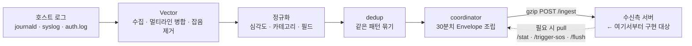

# log_parser

호스트 로그를 수집·정제·압축하여 수신측 서버로 30분마다 자동 전송하는 경량 Rust 에이전트.

**이 문서의 대상**: log_parser가 보내는 데이터를 받는 서버를 개발·운영하는 팀

> 최근 변경 내역은 맨 아래 [변경 이력](#변경-이력) 참조.

---

## 설계 의도 · 책임 경계 (먼저 읽기)

이 프로젝트가 왜 이렇게 나뉘어 있는지 이해하려면 **책임 경계** 하나만 잡으면 된다.

**파서(엣지)가 하는 일 = 수집 → 정제(정규화·dedup) → 압축 → 전송.** 그게 전부다.
감시 대상 호스트마다 얹혀 도는 에이전트라 **의도적으로 가볍게**(cgroup 기본 메모리 128MB / CPU 5%) 묶여 있다.

**파서가 하지 않는 일 = 저장·조회·분석·검색.** 로그를 오래 쌓아두거나(DB·시계열), 의미 검색(벡터)하거나, 대시보드로 집계하는 것은 **전부 중앙 플랫폼(수신측)의 몫**이다. 파서는 데이터 저장 방식을 책임지지 않는다 — 처리해서 내보낼 뿐이고, "어떻게 저장·질의할지"는 받는 쪽이 정한다.

> **왜 이 경계인가**: 파서는 고객의 실제 서비스가 도는 호스트에 얹혀산다. 거기에 DB·벡터엔진을 심으면 감시 대상과 자원을 다투고 "경량 에이전트" 정체성이 깨진다. 그래서 무거운 저장·분석은 감시 대상 밖의 중앙으로 전부 뺀다.

이 경계가 디렉토리 구성으로 그대로 드러난다:

| 위치 | 담당 | 성격 |
|------|------|------|
| [`config/`](config/) | 파서가 **무엇을 어떻게 처리하는가** (분류·필드·전송 설정) | 파서 소유(정본) |
| [`docs/`](docs/) | 설계·계약 — 파서가 **무엇을 내보내는가**, 그리고 저장은 왜 중앙 몫인가 | 파서 소유(정본) |
| [`reference/`](reference/) | 중앙(수신측 `log_stack_AI`)의 산출물 **참조 스냅샷** — 정본 아님 | 읽기 전용 사본 |

- 저장을 중앙이 어떻게 할지 정한 **계약**: [`docs/6_SCALE_CONTRACT.md`](docs/6_SCALE_CONTRACT.md) (증분 pull·이벤트 스토어는 미채택, 기존 push/스냅샷으로 소비하기로 결정)
- 중앙 플랫폼을 실제로 짓는 **로드맵**: `log_stack_AI/docs/1_CENTRAL_PLATFORM_ROADMAP.md` (별도 repo)

---

## 사전 요건 · 빠른 시작 (새 서버 bring-up)

**사전 요건**
- **Linux 호스트** — journald/syslog·`/proc`·cgroup에 의존한다(macOS·Windows에선 실행 불가, 단위 테스트만 가능). 로컬 검증은 Docker로.
- **Vector 실행 파일** — 에이전트가 로그 수집기로 Vector를 **자식 프로세스로 띄운다**. 기본 경로 `/app/vector/bin/vector`(agent.yaml `pipeline.vector_bin`으로 변경 가능). Docker 실행 시 `docker-compose.yml`이 호스트의 `/app/vector`를 마운트하므로 **호스트에 Vector가 설치돼 있어야 한다** — 없으면 수집이 시작되지 않는다.
- **토큰 4개** — `PUSH/FLUSH/STAT/SOS_INBOUND_TOKEN`. 하나라도 미설정이면 **기동 거부**. 채우는 법은 아래 [환경변수 요약](#환경변수-요약).
- 소스 빌드 시 Rust 툴체인, 또는 Docker.

**빠른 시작 — Docker (권장)**
```bash
cp config/.env.example config/.env      # 토큰 4개 채우기 (환경변수 요약 참조)
docker compose up -d --build            # agent_docker.yaml로 기동, :9100 노출
docker compose logs -f log-parser       # 기동·수집 로그 확인
```
> compose에 기본 토큰값이 내장돼 있어 `.env` 없이도 뜨지만, **실배포에선 반드시 교체**한다.

**동작 검증**
- 즉시 확인: `curl -H "Authorization: Bearer <STAT_INBOUND_TOKEN>" http://127.0.0.1:9100/stat`
- 전 경로 E2E: [`tests/`](tests/) 하네스 참조 — 합성 에러 로그 주입(`inject_errors.sh`) → 파서 수집·분류 → (수신측)답변까지 자동 검증. 상세는 [`tests/README.md`](tests/README.md).

---

## ⭐ 가장 중요한 파일 (반드시 직접 관리)

각 파일이 하는 일은 다음과 같다.

### `config/agent.yaml` — 에이전트 동작 정의 ⭐

수집 대상(journald·syslog·auth.log 등 어떤 로그를 모을지), 전송 주기·목적지(30분마다 어느 수신측으로 push),
호스트 식별(`cycle.host_override` 로 표시 이름 고정), inbound 포트·토큰, spool·재시도 정책 등
**에이전트의 모든 동작**을 정의한다. 이 파일이 잘못되면 데이터 수집·전송 자체가 흔들린다.

### `config/categories.yaml` — 로그 분류 규칙 ⭐

원본 로그를 카테고리(예: `kernel.oom`, `auth.event`, `session.activity`)로 가르는 규칙이다.
위에서부터 first-match-wins 정규식으로 매칭하고, `program:` 조건으로 출처(sshd/CRON 등)까지 구분한다(본문이 같아도 출처가 다른 로그를 가름).
규칙을 구체적인 것일수록 위에, 광범위한 것일수록 아래에 두며 맨 끝의 빈 패턴이 `system.general` fallback이다.
이 카테고리 체계가 **시스템 전체의 뼈대**라서, 수신측(log_stack_AI)의 검색 한국어 설명(`CATEGORY_KO`)·`goldset.yaml`·`playbook.yaml` 이 모두 여기에 맞물려 있다.
**분류가 어긋나면 수신측 분석·검색 품질이 그대로 떨어진다.** 코드 변경 없이 이 파일 수정 + 에이전트 재시작으로 반영된다.

> 따라서 `categories.yaml` **을 바꾸면** 수신측의 `CATEGORY_KO`·`goldset.yaml`(검색 채점 기준)·`playbook.yaml`(원인·대처 지식)도
> **반드시 같이 손봐야 한다**(카테고리가 서로 맞물려 있음).
>
> 📎 **참고**: 맞물린 수신측 파일 두 개(`playbook.yaml`, `goldset.yaml`)의 스냅샷을 인수인계용으로
> [`reference/stack/`](reference/stack/) 에 복사해 두었다. 카테고리를 바꿀 때 무엇이 함께 바뀌어야 하는지
> 거기서 실물로 확인할 수 있다. **정본은 `log_stack_AI`** 이며, 사본은 자동 갱신되지 않는다
> (동기화 방법은 [`reference/stack/README.md`](reference/stack/README.md) 참조).

### `config/fields.yaml` — 필드 추출 규칙 ⭐

로그 본문에서 구조화 필드(`pid`, `user`, `dev`, `unit` …)를 뽑는 규칙이다. 예전에는 소스 코드에
하드코딩돼 있었으나, 이제 이 파일에서 정의한다 — **코드 변경·재빌드 없이** 규칙을 추가할 수 있다(`categories.yaml`과 동일 방식).

- `fields:` — 각 규칙은 정규식 캡처그룹 1을 값으로 저장한다(`numeric: true` 면 정수로).
- `settings.logfmt: true` — 메시지 안의 임의 `key=value`(예: `site=naver.com code=200 duration=1.5`)를 자동 필드로 승격.
- `settings.json: true` — 메시지 안의 JSON 객체(`{...}`) 최상위 스칼라를 자동 필드로 승격.
- `settings.allow` / `settings.max_auto_fields` — 자동 승격 필드의 **화이트리스트**와 **개수 상한**. auditd 처럼 `key=value` 가 폭주하는 로그를 막는 안전장치다(비우면 상한까지 전부 허용).

추출된 필드는 dedup·수신측 검색 라벨로 쓰이며, `categories.yaml`의 `logger:` 조건도 여기서 뽑은 `logger` 필드를 참조한다.
파일이 없거나 깨지면 에이전트는 기존 내장(builtin) 추출기 6종으로 자동 fallback 한다.

```markdown
categories = 로그 분류
fields = 필드 추출
playbook = 답변 지식 (재료) ← 여기만 정정
goldset = 검색 채점 기준 (점수)

(수집 시점) 분류 → 필드추출 ← 로그 들어올 때 미리
(질문 시점) 검색+게이트 → playbook 답변 ← 질문할 때
(측정, 따로) goldset 채점 ← 평가하고 싶을 때 수동
```

---

## 📎 참고로 중요한 파일 — 수신측 산출물 (파서 소유 아님)

> 위 `config/*.yaml` 은 **파서가 소유·직접 관리**하는 정본이다.
> 아래 둘은 성격이 다르다 — **중앙(수신측 `log_stack_AI`)의 산출물**이고, 여기 있는 건 인수인계용 **읽기 전용 스냅샷**이다.
> **이 파일들은 여기서 편집하지 않는다. 정본은 `log_stack_AI`.** (파서는 로그 저장·검색·답변을 책임지지 않는다 — [설계 의도 · 책임 경계](#설계-의도--책임-경계-먼저-읽기) 참조)

| 파일 | 무엇 | 정본 위치 |
|------|------|-----------|
| [`reference/stack/playbook.yaml`](reference/stack/playbook.yaml) | 카테고리별 원인·확인명령·표준대처 지식 (수신측 분석 LLM 프롬프트에 주입) | `log_stack_AI/playbook.yaml` |
| [`reference/stack/goldset.yaml`](reference/stack/goldset.yaml) | 검색 품질 평가용 정답셋 (질문 + 정답 uid) | `log_stack_AI/goldset/goldset.yaml` |

이 둘을 여기 둔 이유: 위 `config/categories.yaml` 을 바꾸면 **반드시 같이 갱신해야** 하는 하류 파일이라, 카테고리 변경 시 무엇이 함께 바뀌는지 실물로 보라고 스냅샷을 둔 것이다. 사본은 자동 갱신되지 않는다 — 동기화 방법은 [`reference/stack/README.md`](reference/stack/README.md) 참조.

---

## 전체 흐름



파서(엣지)가 **수집 → 정규화 → 중복 묶기 → 30분마다 push**까지 하고, 저장·조회·분석은 수신측 몫이다. 필요하면 수신측이 pull 창구를 직접 호출한다.

에이전트와 수신측 서버 간의 통신은 두 가지 방향이 있습니다.

| 방향       | 호출자    | 수신자    | 수신측이 구현할 것               |
| -------- | ------ | ------ | ------------------------ |
| **push** | 에이전트   | 수신측 서버 | `POST /ingest` 엔드포인트     |
| **pull** | 수신측 서버 | 에이전트   | `GET/POST` 호출 클라이언트 (선택) |

- **push** — 에이전트가 30분마다 자동으로 수신측 서버로 HTTP POST를 보냅니다.
- **pull** — 수신측 서버가 필요할 때 에이전트의 `/stat`, `/trigger-sos` 엔드포인트를 직접 호출할 수 있습니다.

> **Vector 수집** — 파일 소스의 여러 줄 로그(스택트레이스)를 타임스탬프 헤더 기준 **한 이벤트로 병합**(multiline)하고 **노이즈 필터(drop_noise)**로 잡음(기본 journald debug)을 버린다. `vector.toml`은 distro 감지로 **자동 생성**(직접 편집 안 함).
>
> 흐름 다이어그램(push/pull)과 로그 한 줄이 거치는 **7단계 상세**는 [`docs/8_PIPELINE.md`](docs/8_PIPELINE.md).

---

## 에이전트 연결 설정

에이전트 설정 파일(`agent.yaml`)의 `transport` 섹션을 수정합니다.

```yaml
transport:
  kind: "http_json"
  endpoint: "https://your-server.example.com/ingest"   # ← 수신측 URL
  token_env: "PUSH_OUTBOUND_TOKEN"                       # 환경변수명
  connect_timeout_seconds: 10
  request_timeout_seconds: 30
  http_gzip_level: 6
```

에이전트 실행 환경에 토큰을 환경변수로 주입합니다.

```bash
export PUSH_OUTBOUND_TOKEN="수신측에서_발급한_Bearer_토큰"
```

**Docker 사용 시** `docker-compose.yml`:

```yaml
environment:
  PUSH_OUTBOUND_TOKEN: "수신측에서_발급한_Bearer_토큰"
```

> `PUSH_OUTBOUND_TOKEN` · `FLUSH_INBOUND_TOKEN` · `STAT_INBOUND_TOKEN` · `SOS_INBOUND_TOKEN` 중 하나라도 비어있으면 **에이전트 기동이 거부**됩니다.

**호스트 식별 (다중 서버 운영 시)** — `cycle.host_id` 는 machine-id 기반으로 자동 산출되어 재설치 전까지 불변입니다. 표시용 이름 `cycle.host` 는 기본적으로 시스템 hostname 을 쓰지만, 여러 서버를 한 수신측으로 모으거나 컨테이너에서 hostname 이 불안정할 때는 `agent.yaml` 의 `cycle.host_override` 로 고정할 수 있습니다.

```yaml
cycle:
  host_override: "web-prod-01"   # 비우면 시스템 hostname 사용
```

---

## 수신 엔드포인트 구현 요건

### 요청 형식

```
POST <transport.endpoint>
Authorization: Bearer <PUSH_OUTBOUND_TOKEN>
Content-Type: application/json
Content-Encoding: gzip
```

- Body는 **gzip 압축된 JSON**입니다. 반드시 압축 해제 후 파싱하세요.
- 대부분의 HTTP 프레임워크(requests, httpx, axios 등)는 `Content-Encoding: gzip`을 자동으로 처리합니다.

### 응답 코드 (수신측 → 에이전트 push 응답)

> 에이전트가 `POST /ingest`로 push했을 때 **수신측이 돌려주는** 코드와 그에 대한 에이전트 반응. (반대 방향인 pull 응답은 [On-demand Pull API](#on-demand-pull-api)의 "에러 응답 코드" 참조)

| 코드                  | 의미         | 에이전트 동작                                    |
| ------------------- | ---------- | ------------------------------------------ |
| `200`, `202`, `204` | 수신 성공      | spool에서 파일 삭제, 다음 cycle 시작                 |
| `429`               | Rate limit | 재시도 (지수 백오프)                               |
| `5xx`               | 서버 오류      | 재시도 (지수 백오프)                               |
| `401`, `403`        | 인증 오류      | **재시도 없음** — `retry/`로 이동 (drain API로 재전송) |
| `4xx` (기타)          | 요청 오류      | **재시도 없음** — `retry/`로 이동 (drain API로 재전송) |

### spool (WAL) 두 풀 구조

spool은 두 디렉터리로 구성됩니다.

```
spool_dir/           (기본: /var/lib/log_parser/spool)
├── new/             ← 현재 전송 대기 중인 WAL 파일
└── retry/           ← 전송 실패 후 drain 대기 중인 파일
```

**new/ 풀 동작**

에이전트는 30분 cycle envelope을 전송하기 **전에** `new/`에 저장합니다 (WAL 원칙). 전송 성공 시 즉시 삭제, 실패(재시도 한도 초과 또는 4xx) 시 `retry/`로 이동합니다. 데몬 재시작 후에는 `new/` 내 미처리 파일을 최대 4건 동시 재전송합니다.

**retry/ 풀 동작**

`retry/`에 쌓인 파일은 자동 재전송되지 않습니다. 수신측 서버가 `POST :9100/drain-spool`을 호출해 시간 창을 지정하면 해당 창의 파일을 재전송합니다. 파일명은 ULID이므로 생성 시각 기준 필터링이 가능합니다.

> **⚠ retry/ 상한·TTL** — `retry/`는 무한정 쌓이지 않는다. `transport.retry_max_mb`(기본 256MB)·`transport.retry_ttl_hours`(기본 72h)를 넘으면 **오래된 미배달 파일부터 자동 삭제**된다(수신측 장기 다운 시 호스트 디스크 보호). 즉 drain 없이 방치하면 TTL·용량 초과분은 유실될 수 있으므로, 장기 미배달이 예상되면 그 전에 `drain-spool`로 회수해야 한다. (0으로 설정하면 각각 무제한)

---

## 데이터 구조

> 수신측 서버를 구성할 때는 `[docs/RECEIVER_TYPE_SPEC.md](docs/RECEIVER_TYPE_SPEC.md)`를 참조하세요.
> Envelope·DedupEvent·최대 7개 섹션(metrics/processes/network/systemd/static_state/config/hardware) 전체의 상세 타입 정의와 제약 조건이 정리되어 있습니다.

### 세 가지 Envelope 한눈 비교

에이전트가 생성하는 Envelope은 세 종류입니다. **sos = stat + log** 관계입니다.

| 섹션             | 수집 출처                                                                      | stat_snapshot | log_batch | sos_snapshot | 전송 방식              |
| -------------- | -------------------------------------------------------------------------- | ------------- | --------- | ------------ | ------------------ |
| `metrics`      | /proc/stat, /proc/meminfo, /proc/diskstats, /proc/loadavg, /proc/pressure/ | ✅             |           | ✅            | pull 즉시 / 사고 시     |
| `processes`    | /proc/pid/                                                                 | ✅             |           | ✅            | pull 즉시 / 사고 시     |
| `network`      | /proc/net/tcp, /proc/net/sockstat, sysfs                                   | ✅             |           | ✅            | pull 즉시 / 사고 시     |
| `systemd`      | systemctl 상태                                                               | ✅             |           | ✅            | pull 즉시 / 사고 시     |
| `static_state` | /proc/cmdline, /proc/sys/, /sys/fs/selinux, lsmod, chronyc                 | ✅             |           | ✅            | pull 즉시 / 사고 시     |
| `config`       | /etc/sysctl.conf, /etc/hosts, /etc/hostname, 패키지 목록                        | ✅             |           | ✅            | pull 즉시 / 사고 시     |
| `hardware`     | /proc/cpuinfo, /proc/meminfo, /sys/block/, lspci                           | ✅             |           | ✅            | pull 즉시 / 사고 시     |
| `logs`         | journald, syslog, auth.log, audit.log                                      |               | ✅ (30분치)  | ✅ (4시간치)     | 30분 자동 push / 사고 시 |

> **config vs static_state 구분**: `config`는 설정 파일 원본 내용(`/etc/sysctl.conf`에 뭐라고 써있나), `static_state`는 현재 실제 적용된 런타임 값(`sysctl -a`로 지금 무엇이 동작 중인가). 파일 내용과 런타임 적용값이 다를 수 있으므로 둘 다 필요.

|            | stat_snapshot           | log_batch   | sos_snapshot                    |
| ---------- | ----------------------- | ----------- | ------------------------------- |
| **트리거**    | `GET /stat` (on-demand) | 30분 자동 push | `POST /trigger-sos` (on-demand) |
| **섹션 수**   | 최대 7개                   | 1개 (`logs`) | 최대 8개                           |
| **로그 포함**  | ❌                       | ✅ 30분치      | ✅ 최근 4시간 (최대 500개)              |
| **seq 필드** | 없음                      | 있음 (단조 증가)  | 없음                              |
| **소요 시간**  | ~200ms                  | 백그라운드       | 수 초~수십 초                        |

---

### 상세 타입 정의 → `docs/RECEIVER_TYPE_SPEC.md`

Envelope 공통 구조, `log_batch`/`stat_snapshot`/`sos_snapshot` 각 스키마, **DedupEvent**, **Category 분류표**, 7개 섹션(metrics·processes·network·systemd·static_state·config·hardware) 타입은 전부 [`docs/RECEIVER_TYPE_SPEC.md`](docs/RECEIVER_TYPE_SPEC.md)에 정리돼 있다(**정본**). 여기서는 핵심만:

- **event_kind** — `log_batch`(30분 자동 push) · `stat_snapshot`(GET /stat) · `sos_snapshot`(POST /trigger-sos)
- **중복 방지 키** — `cycle.host_id + boot_id + seq` (seq는 재시작 후에도 이어짐 → [중복 수신 방지](#중복-수신-방지))
- **DedupEvent 핵심 필드** — `source` · `severity` · `category` · `template` · `fingerprint` · `count` · `sample_raws` · `fields` · `ts_first`/`ts_last`
- **severity** — `critical`(kernel panic·OOM·oops 등 키워드 감지) / `error` / `warn` / `info`
- **Category** — 분류 규칙 정본은 [`config/categories.yaml`](config/categories.yaml), 코드별 표는 `RECEIVER_TYPE_SPEC.md` §4

> **수신측 알림 기준(요약)** — `severity=critical` · `kernel.oom`/`kernel.panic` · `fs.readonly`는 즉시 알림, `auth.bruteforce`는 보안 알림, `count>=10`은 에러 폭증. 상세 룰은 [`docs/4_RECEIVER_CONTRACT.md`](docs/4_RECEIVER_CONTRACT.md).

---

## On-demand Pull API

에이전트가 `127.0.0.1:9100`에서 제공하는 pull 엔드포인트(수신측이 필요 시 호출). 원격 호출은 `agent.yaml`의 `inbound.listen_addr` + 방화벽. **curl 예시·파라미터·에러 코드 상세는 [`docs/7_PULL_API.md`](docs/7_PULL_API.md).**

| 엔드포인트 | 용도 | 토큰 | 응답 |
|---|---|---|---|
| `GET /stat` | 현재 시스템 상태 | STAT | `stat_snapshot` |
| `POST /trigger-sos` | SOS 진단(최근 4h 로그) | SOS | `sos_snapshot` (타임아웃 120s+) |
| `POST /flush` | 현재 cycle 즉시 방출(디버그) | FLUSH | envelope (응답 바디, `/ingest` 아님) |
| `POST /drain-spool?from&to` | `retry/` 재전송 | FLUSH | `202` (백그라운드) |
| `GET /drain-status` | drain 진행 조회 | FLUSH | idle/in_progress/completed |

---

## 중복 수신 방지

에이전트는 네트워크 오류 시 재전송하므로, 수신측이 **멱등성**을 보장해야 한다. 고유 키는 **`(host_id, boot_id, seq)`** — 세 값이 모두 같으면 같은 데이터로 보고 한 번만 처리(upsert).

- `boot_id`는 재부팅마다 바뀌므로, 재부팅 전후 `seq`가 겹쳐도 별개 데이터다.
- `stat_snapshot`/`sos_snapshot`은 `seq` 필드가 없다(키 생략). `ts` 보조 키를 쓰되 초 단위라 같은 초 두 번 호출 시 충돌 → on-demand 응답은 upsert 권장.

> 예시 코드(`is_duplicate`)는 [`examples/receiver_example.py`](examples/receiver_example.py), 계약은 [`docs/4_RECEIVER_CONTRACT.md`](docs/4_RECEIVER_CONTRACT.md).

---

## 재시도 정책

| 상황                         | 에이전트 동작                                                                                              |
| -------------------------- | ---------------------------------------------------------------------------------------------------- |
| 수신측 5xx / 네트워크 오류          | 재시도 (5s → 10s → 20s … 최대 300s 간격, `retry_base_seconds` 설정)                                           |
| `critical` 이벤트 포함 envelope | 무한 재시도 (포기 없음)                                                                                       |
| 일반 envelope                | 기본 **5회 재시도** 후 포기 (`transport.retry_max_normal` 설정, 초기 전송 포함 최대 6회) — `retry/`로 이동 (drain API로 재전송) |
| 수신측 4xx                    | 즉시 포기, spool 파일 `retry/`로 이동 (drain API로 재전송)                                                        |

`new/` spool 용량 초과 시 가장 오래된 파일을 `retry/`로 이동한 뒤 새 envelope을 저장합니다. 수신측 다운이 길어질 것으로 예상되면 `transport.spool_max_mb`를 늘리세요.

---

## 운영 권장 사항

### 호스트 침묵 감지

에이전트는 30분마다 전송합니다. **35분** 이상 `log_batch`가 오지 않으면 해당 호스트를 점검하세요(에이전트 다운·네트워크 단절 의심).

### 사고 발생 시 흐름

1. `log_batch`에서 `critical` 감지 또는 `category=kernel.oom` 확인
2. `GET :9100/stat` 호출 → 현재 CPU/메모리/프로세스 상태 확인 (원격 접근 설정 필요 → Pull API 참조)
3. `POST :9100/trigger-sos` 호출 → 최근 4시간 상세 로그 + 전체 시스템 상태 수집
4. `fingerprint`로 동일 패턴이 다른 서버에도 퍼져 있는지 확인

### fingerprint 활용

서버 간 같은 `fingerprint`가 동시에 발생하면 인프라 공통 장애를 의심하세요(같은 지문 = 같은 사건 패턴이 여러 호스트에 확산).

---

## 구현 예시 (수신측)

수신측 `/ingest` 핸들러 · 필터링 · 중복제거(멱등) 예시 코드는 [`examples/receiver_example.py`](examples/receiver_example.py) 참조.

---

## 에이전트 빌드 및 실행

```bash
# 빌드
cargo build --release

# 디렉터리 준비
mkdir -p /run/log_parser /var/lib/log_parser/spool/new /var/lib/log_parser/spool/retry /etc/log_parser

# 설정·분류·필드 규칙 배치 (기본 경로: /etc/log_parser/)
cp config/agent.yaml config/categories.yaml config/fields.yaml /etc/log_parser/

# 환경변수 설정 (토큰 4개 — 아래 "환경변수 요약" 참조)
cp config/.env.example config/.env   # 토큰 값 입력

# 실행
set -a && source config/.env && set +a
./target/release/log_parser /etc/log_parser/agent.yaml

# 종료
kill -TERM <PID>
```

> **Docker로 실행 시** — `docker compose up -d` 를 쓰면 `docker-compose.yml` 이 `agent.yaml`·`categories.yaml`·`fields.yaml` 을 컨테이너의 `/etc/log_parser/` 로 볼륨 마운트한다(config 변경은 런타임 마운트라 **이미지 재빌드 불필요**, `down && up -d` 재기동만으로 반영). ⚠ **새 설정 파일을 추가하면 compose 볼륨에도 반드시 등록**해야 컨테이너가 읽는다 — 등록 누락 시 해당 파일은 builtin fallback으로 동작한다.

---

## 환경변수 요약

| 환경변수                  | 용도                                                        | 필수                   |
| --------------------- | --------------------------------------------------------- | -------------------- |
| `PUSH_OUTBOUND_TOKEN` | `/ingest` 수신측 Bearer 토큰                                   | **필수** (미설정 시 기동 거부) |
| `FLUSH_INBOUND_TOKEN` | `/flush` · `/drain-spool` · `/drain-status` 토큰            | **필수** (미설정 시 기동 거부) |
| `STAT_INBOUND_TOKEN`  | `/stat` 호출 토큰                                             | **필수** (미설정 시 기동 거부) |
| `SOS_INBOUND_TOKEN`   | `/trigger-sos` 호출 토큰                                      | **필수** (미설정 시 기동 거부) |
| `CATEGORIES_PATH`     | categories.yaml 경로 (기본 `/etc/log_parser/categories.yaml`) | 선택                   |
| `FIELDS_PATH`         | fields.yaml 경로 (기본 `/etc/log_parser/fields.yaml`)         | 선택                   |
| `RUST_LOG`            | 로그 레벨 (`info` / `debug` / `warn`)                         | 선택                   |

---

## 디렉토리 구조

```
log_parser/
├── src/                        # Rust 소스
├── config/
│   ├── agent.yaml              # 에이전트 설정 (전체 키·기본값)
│   ├── agent_docker.yaml       # Docker 실행용 설정
│   ├── agent_test.yaml         # 테스트용 설정
│   ├── categories.yaml         # 로그 카테고리 분류 규칙
│   ├── fields.yaml             # 필드 추출 규칙 (logfmt/json 자동파싱 포함)
│   ├── vector.toml             # ⚠ 참고용 스냅샷 — 실배포 설정은 vector_config.rs가 런타임 자동 생성
│   └── .env.example            # 환경변수 템플릿
├── examples/                   # envelope 응답 샘플 (JSON)
├── docs/                       # 내부 설계·계약 문서 (docs/README.md = 색인)
├── reference/stack/            # 수신측(log_stack_AI) 참조 스냅샷 (playbook·goldset, 정본 아님)
├── tests/                      # E2E 테스트 하네스 (error_cases.yaml·inject_errors.sh)
├── data/spool/                 # 런타임 spool WAL (Docker mount point)
├── Dockerfile
├── docker-compose.yml
├── CHANGELOG.md                # 변경 이력
└── Cargo.toml
```

---

## 읽기 순서

각 디렉토리의 README.md를 순서대로 읽으면 전체 구조를 파악할 수 있습니다.

1. [config/README.md](config/README.md) — 설정 파일 구성과 주요 파라미터
2. [src/README.md](src/README.md) — 소스 모듈 전체 구조
3. [src/platform/README.md](src/platform/README.md) — 호스트 환경 감지 (에이전트 시작 시 가장 먼저 실행)
4. [src/pipeline/README.md](src/pipeline/README.md) — 로그 수집
5. [src/normalize/README.md](src/normalize/README.md) → [src/dedup/README.md](src/dedup/README.md) — 정규화·중복 제거
6. [src/coordinator/README.md](src/coordinator/README.md) → [src/transport/README.md](src/transport/README.md) — Cycle 조립·전송
7. [src/inbound/README.md](src/inbound/README.md) — Pull API
8. [examples/README.md](examples/README.md) — 실제 envelope 샘플

---

## 변경 이력

전체 변경 이력은 [`CHANGELOG.md`](CHANGELOG.md) 참조.
