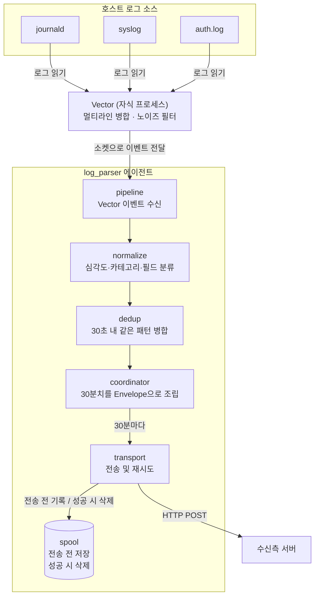
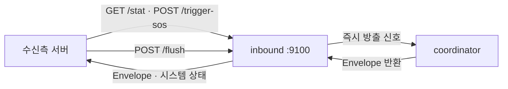
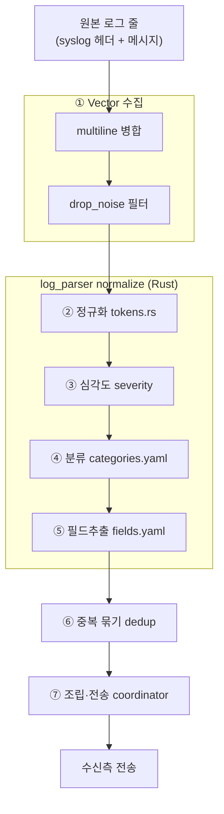

# 처리 파이프라인 — 단계별 상세

로그 한 줄이 수집→전송까지 거치는 단계의 상세. (개요·다이어그램은 루트 [`README.md`](../README.md#전체-흐름))

## 흐름도

**Push — 30분마다 자동 전송**

**Pull — 수신 서버가 에이전트에 직접 요청**

## 로그 한 줄이 처리되는 과정 (단계별)

**여러 겹 정수기 필터**를 떠올리면 쉽다 — 지저분한 원본 로그가 단계를 지날 때마다 걸러지고 라벨이 붙어, 마지막엔 깔끔하게 정리된 한 건으로 나온다.

| 단계                           | 하는 일 (쉽게)                                                                         | 자세히                                                                              | 결과물                                 |
| ---------------------------- | --------------------------------------------------------------------------------- | -------------------------------------------------------------------------------- | ----------------------------------- |
| **① Vector 수집**              | 로그를 읽어오면서, 여러 줄로 쪼개진 로그(자바 에러 등)를 **한 덩어리로 붙이고** 쓸모없는 잡음은 **버린다**                 | 타임스탬프 헤더로 이벤트 경계 판정 → 후속 줄 병합(multiline), `drop_noise`로 잡음(기본 journald debug) 폐기 | 깔끔해진 로그 이벤트                         |
| **② 정규화** (`tokens.rs`)      | 로그마다 다른 부분(IP·숫자·날짜·경로)을 `<IP4>`·`<NUM>` 같은 **자리표시자로 바꿔**, 같은 종류 로그가 같은 모양이 되게 한다 | syslog 헤더(RFC3164·ISO) strip 후 가변 토큰 치환(UUID·IP·경로·숫자 등)                         | 정규 문장 `template` + 지문 `fingerprint` |
| **③ 심각도** (`severity`)       | 이 로그가 **얼마나 급한지** 판정                                                              | PRIORITY·키워드로 매핑                                                                 | `critical`/`error`/`warn`/`info`    |
| **④ 분류** (`categories.yaml`) | 로그가 **무슨 사건인지 이름표**를 붙인다 (메모리 부족·로그인 실패 등)                                        | aho-corasick으로 후보만 추린 뒤 정규식 first-match, `program`/`logger` 게이트                  | 카테고리 (예: `kernel.oom`)              |
| **⑤ 필드 추출** (`fields.yaml`)  | 로그에서 **누가·무엇을**(사용자·PID·서비스명) 꺼내 따로 정리                                            | 정규식 캡처(`pid`·`user`·`dev`·`unit`) + `logfmt`/`json` 자동 승격                        | `fields` (예: `{user: root}`)        |
| **⑥ 중복 묶기** (`dedup`)        | 30초 안에 **똑같은 로그가 여러 번** 오면 하나로 합치고 횟수만 센다                                         | 같은 `fingerprint` 병합, 발생 수 누적, 원본 샘플 보존                                           | 묶인 `DedupEvent` (`count` 포함)        |
| **⑦ 조립·전송** (`coordinator`)  | 30분치를 모아 **한 봉투(Envelope)로 싸서** 수신 서버로 보낸다                                        | 카테고리·심각도 집계, 사이클·헤더 메타 부착                                                        | `Envelope` → HTTP POST              |

> 최종 산출물 `DedupEvent`·카테고리 목록의 타입 정의는 [`receiver-type-spec.md`](receiver-type-spec.md).

### ④ 분류 · ⑤ 필드 추출 · ⑥ 중복 묶기 — 뭐가 다른가

셋 다 로그를 "처리"하지만 **목적이 다르다.** 로그 한 줄 `Out of memory: Killed process 2481 (java)` 로 비교하면:

| 단계          | 답하는 질문                | 이 예시에서 하는 일                            |
| ----------- | --------------------- | -------------------------------------- |
| **④ 분류**    | "이게 **무슨 종류** 사건이야?"  | `kernel.oom`(메모리 부족)이라는 **이름표**를 붙임    |
| **⑤ 필드 추출** | "그 안에 **구체적 값**이 뭐야?" | `pid=2481` 같은 **속 알맹이 값**을 뽑음          |
| **⑥ 중복 묶기** | "그게 **몇 번** 일어났어?"    | 같은 로그가 5번 오면 → **1건 +** `count=5` 로 압축 |

한마디로 **④는 종류 이름표, ⑤는 속 알맹이, ⑥은 반복 횟수**. ④·⑤는 로그 하나를 **풍부하게**(라벨·값), ⑥은 여러 개를 **줄이는**(합치기) 단계다.
